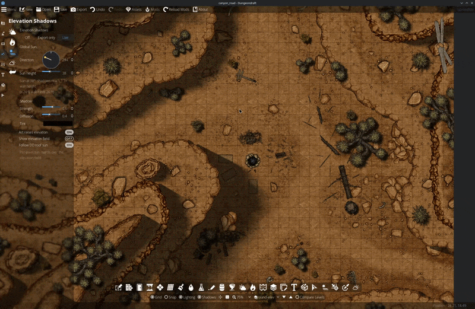
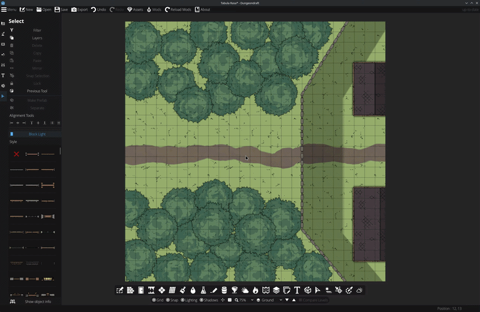
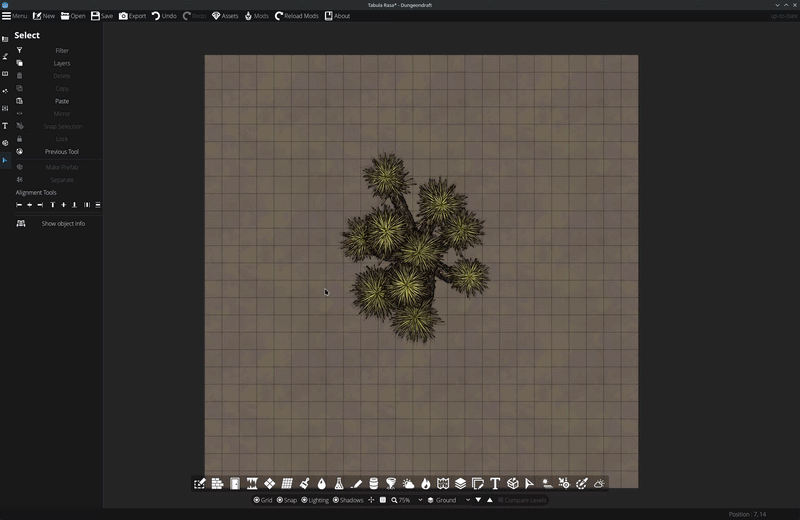

# Elevation Shadows

**A sun for your [Dungeondraft](https://dungeondraft.net/) map.** Tag a cliff
with a height in feet, and the mod works out the shadow — the right length for
that height and that sun, softening as it travels, stacking across tiers,
respecting your layers. Then it keeps going: light through windows, patterns
through grates, and a tree's own artwork stretched across the ground.

Heights are in feet, one grid square = 5 ft, and a 20 ft cliff casts exactly
`height / tan(sun altitude)`. Want drama? Lower the sun. The numbers stay
honest.

---

## Turn the sun, and the canyon turns with it

Every cliff edge here is an ordinary Dungeondraft path, drawn the way you
already draw them — nested contours on one level. Tagging them with a drop
height is the whole job. The mod rasterises those contours into a height field
and marches each pixel toward the sun, so the shadows are *computed*, not
stamped: they lengthen as the sun drops, sweep as it turns, fall correctly
across the tiers below them, and never double-darken where they overlap.

The soft edges are real penumbra. Diffusion models the sun's angular size, so
blur widens with distance from the cliff the way it does outdoors — crisp
desert light at one end of the slider, overcast at the other.

Panning and zooming cost nothing; it's all baked and only re-bakes when
something actually changes.

---

## Windows throw light, not just gaps

Doors and windows are Dungeondraft portals, and each one can be opened to the
sun. An open portal cuts a gap in its wall's shadow — but it can also **project
its pattern**: pick Bars, Window panes, Diamond lattice, Plus holes or Checker,
set how high the opening sits in the wall, and the light lands on the floor as
the classic window cross, skewed and stretched by the sun's angle.

Projection is independent of everything else. A closed door still projects. A
house set to shade only its exterior — so Dungeondraft's own interior lights
read correctly — still gets window patterns across its floor. It works on a map
with no elevation shadows at all.

---

## Cast a tree from a tree

Objects cast too, and this is the fun one. Point an object's pattern at a
**custom texture** — any PNG or WebP, where any pixel above 0% opacity blocks
the light — and set **Profile** mode. The image stands up from the middle of
the object and stretches along the ground.

Here that texture is the yucca's own asset art. Raise *Shadow top* and the
shadow reaches further, exactly as a taller wall would. Turn the sun and the
whole silhouette swings around the trunk. Draw a tree from the side and cast it
from a top-down tree; hang the pattern off the ground for something suspended;
or use **Traced** mode instead to sweep the object's real outline along the sun
with a pattern tiled into it — crates, cages, grates.

---

## The rest of it

- **Terrain steps and free-standing walls.** A path is either a contour (one
  side uphill) or a **Wall** — only its own strip raised, both sides low. A
  closed circle of wall shades its own interior on the sun-facing arc: instant
  crater.
- **One-sided walls.** On a Dungeondraft wall, Side A / Side B cast on *one*
  side only. A closed house wall on Side A shades the outside world while the
  interior stays completely lit; Side B shades the inside only, for courtyards.
- **Multi-tier stacking.** Three 5 ft contours make a 15 ft summit, and the
  shadow length follows.
- **Respects your layering.** A layer-4 path's shadow darkens layer-2 cliff art.
  Objects escape or receive a shadow with Dungeondraft's own **Bring to front /
  Send to back** — per object, saved with the map. Cliff art can hide the
  shadow's leading edge under its own bumpy texture edge.
- **Live readouts.** The path panel says "Casts 34 ft of shadow (6.9 squares)"
  for the selected cliff; the sun panel shows the current shadow-to-height
  ratio.
- **Tint.** Black by default and neutral. Cool blue-violet reads as daylight, a
  warm brown as dusk. Hue only — darkness stays with Strength.
- **Export-ready.** Shadows land in PNG and Universal VTT exports exactly as
  layered in the editor, and the textures re-bake at double resolution while the
  export dialog is open, so a 100 px/square export stays crisp.
- **Live / Export-only / Off** modes, so you can keep the editor light and only
  pay for shadows on the way out.

---

## Install

Copy the `ElevationShadows` folder into your Dungeondraft `mods` directory and
enable **Elevation Shadows** in the Mods menu. Built and tested against
Dungeondraft 1.2.0.1.

## Five-minute start

1. Open the **Elevation Shadows** tool (Effects category) and set **Direction**
   and **Sun height**.
2. Draw a cliff as a normal path, on whatever layer it belongs to.
3. Select it, switch on **Elevation Shadow**, and pick a side: **Side A/B** for
   a terrain step (which side is uphill), or **Wall (both)** for a free-standing
   wall. Flip it once if the fill lands on the wrong side.
4. Set **Drop height** in feet. The readout tells you what it casts at the
   current sun.
5. Objects on the caster's layer start lit — **Send to back** pushes one under
   the shadow, **Bring to front** lifts it out.
6. Export as usual.

<b>Every setting</b>

### Global (Elevation Shadows tool)

| Setting | What it does |
|---|---|
| Off / Export only / Live | Master mode. Export only keeps the editor light and injects shadows only while exporting. |
| Direction | Compass direction the light comes from. |
| Sun height | Sun altitude. Low sun = long shadows. The realism note updates live. |
| Strength | How dark shadows are. |
| Diffusion | The sun's angular size: edge softness, widening with distance. |
| Tint | The shadow's colour cast. Hue only — darkness stays with Strength. |
| Art raises elevation | Contour art itself lifts the height field, so texture bumps read as ground. |
| Show elevation field | Debug overlay of the computed terrain heights. |

### Per path / wall

| Setting | What it does |
|---|---|
| Elevation Shadow | This path casts, and raises the terrain on its uphill side. |
| Side A / Side B / Wall (both) | Paths: which side is uphill, or a free-standing wall strip. Walls: which side the shadow falls on (A/B = one side only). |
| Drop height (ft) | How far the ground drops. Drives shadow length physically. Slider to 120 ft; type into the box for up to 240 ft. |
| Art above shadow | The path's artwork draws over its own layer's shadow, so the texture's real edge hides where the shadow starts. On by default for casters. |
| Shadow inset | Fine-tune (in px) how far the shadow tucks under the art's edge. |

### Per portal (door / window)

| Setting | What it does |
|---|---|
| Open for sunlight | This opening lets the sun through its wall: a gap in the wall's shadow, and cliff shadows behind it pass through the doorway. |
| Project pattern | Cast the pattern onto the floor even where the wall casts no shadow. Independent of the toggle above — a closed door still projects. |
| Light pattern | None (open), Bars, Window panes, Diamond lattice, Plus holes, Checker, or a custom texture. |
| Opening top / bottom (ft) | Where the opening sits in the wall's face. |
| Pattern size (ft) | One bar / pane / plus per this many feet. |

### Per object

| Setting | What it does |
|---|---|
| Cast pattern shadow | This object casts its pattern onto the ground, as if it blocked the sun in that shape. |
| Cast mode | **Traced**: the object's own outline swept along the sun, pattern tiled into it. **Profile**: the image cast once, standing up from the object's middle and stretched along the ground. |
| Pattern | Bars, Window panes, Diamond lattice, Plus holes, Checker, Solid, or a custom texture (alpha above 0% blocks light). |
| Pattern size (ft) | Tile size of the pattern. |
| Shadow top / bottom (ft) | How high up the object the pattern reaches, and how far off the ground it starts. Raise the bottom for something hanging. |
| Width adjust (ft) | The shadow is already as wide as the object's artwork; this widens (+) or narrows (−) it. |

## How it works

Contour paths are treated as topographic lines and rasterised into a height
field — elevation at any point is the sum of every contour whose uphill side
contains it. A per-pixel shader marches from each point toward the sun through
that field, comparing the horizon angle against the sun's angular extent, which
is where both the correct length and the distance-widening penumbra come from.
Portal beams and object patterns ride a second mask that multiplies into the
same bake, so a pattern never fights the march that produced it.

Results are baked to textures — one per Dungeondraft layer in use, placed so
layer ordering works out — and re-baked only when something changes. Per-path,
per-portal and per-object config lives in the map file via Dungeondraft's mod
data, so it all survives save and reload.

## Known bugs

- **Wall and portal shadows ignore layering.** Anything cast by a wall — its
  shadow and its projected portal patterns — draws on top of every user layer,
  so a walkway on layer 400 crossing over a gate still gets the gate's shadow
  painted across it. Dungeondraft keeps walls in their own container above
  layers 100–400, and the shadow inherits that position, so no per-wall or
  per-portal setting can push it under. Paths are unaffected; only wall-based
  casters have this.

  **Workaround:** put the thing that should stay clear on **Above Roofs (900)**,
  which sits above the wall container — a walkway crossing over a gate reads
  correctly there. Keep it a plain object; an *elevation caster* on 700/900 has
  its own trouble with wall openings below it.
- **Follow DD roof sun inverts one axis.** East/west follows correctly,
  north/south is flipped, so roof shading and elevation shadows disagree. Set
  the mod's own Direction until this is fixed.
